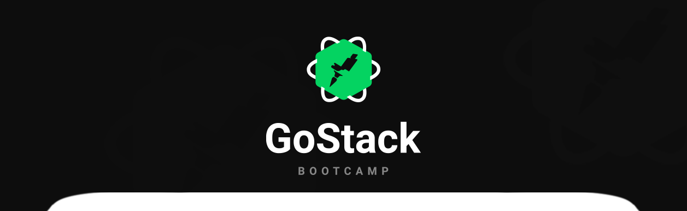
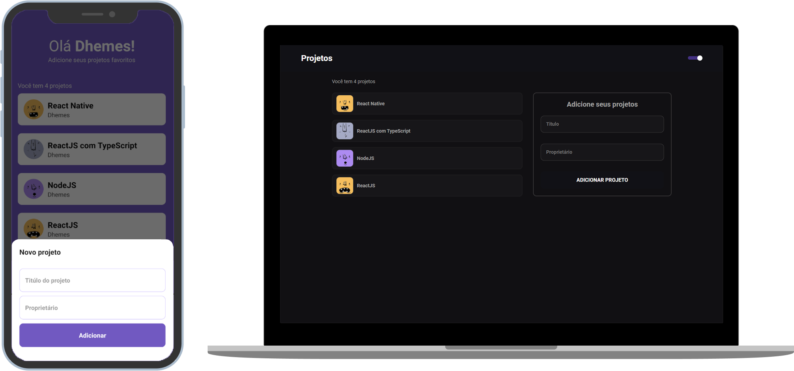

<h1 align="center">GoStack Conceitos</h3>
<h5 align="center">Entendendo os conceitos básicos em ReactJS, React Native e NodeJS</h5>

<p align="center">
  
  
  
  
  
</p>

<small align="center">:thought_balloon: “O Faixa preta, só se tornou faixa preta por ter executado os mesmos comandos várias e várias vezes, até se tornar hábil.”</small><br/>



<p align="center">
  <a href="#books-sobre-o-projeto">Sobre</a>&nbsp;&nbsp;&nbsp;|&nbsp;&nbsp;&nbsp;
  <a href="#trophy-principais-funcionalidades">Funcionalidades</a>&nbsp;&nbsp;&nbsp;|&nbsp;&nbsp;&nbsp;
  <a href="#computer-instruções-de-instalação">Instruções</a>&nbsp;&nbsp;&nbsp;|&nbsp;&nbsp;&nbsp;
  <a href="#hammer-útil">Útil</a>&nbsp;&nbsp;&nbsp;
</p>


## :books: Sobre o projeto
Essa aplicação tem como objetivo entender os conceitos básicos em ReactJS, React Native e NodeJS. Você pode utilizar essa aplicação para entender melhor essa stack, mesmo sendo apenas conceitos a aplicação possui um back-end, front-end e mobile.

<br/>

## :trophy: Principais funcionalidades
- Cadastrar projetos pessoais
- Listar projetos

<br/>

## :computer: Instruções de instalação
:heavy_check_mark: Clone o repositório ou faça o download no formato zip, caso deseje clonar usando o `git`, basta abrir um terminal de linha de comandos, navegar até a pasta desejada onde ficará o projeto e em seguida siga os passos abaixo:<br/>
Antes de mais nada certifique que você tenha um gerenciador de pacotes e o `NodeJS` instalados em sua máquina.
```Bash
# .../suapasta
$ git clone git@github.com:dhemesmota/gostack-conceitos.git
$ cd gostack-conceitos

# .../suapasta/gostack-conceitos
$ ls
backend/  frontend-typescript/ mobile/
```

:heavy_check_mark: Agora é necessário baixar todas as dependências do projeto para que possamos utiliza-lo:<br/>
Eu utilizo o `yarn`, mas você pode utilizar o `npm` se preferir.
```Bash
# .../suapasta/gostack-conceitos
$ cd backend
$ yarn

$ cd ../frontend
$ yarn

$ cd ../mobile
$ yarn
```

:heavy_check_mark: Show! Estamos prontos para executar a aplicação:<br/>
Como essa aplicação utilizar a API do GitHub basta executar e sair utilizando.
```Bash
# .../suapasta/gostack-conceitos/backend
$ yarn dev

# .../suapasta/gostack-conceitos/frontend
$ yarn start

# .../suapasta/gostack-conceitos/mobile
$ yarn android
```

## API

<a align="center" href="https://insomnia.rest/run/?label=GoStack%20Conceitos&uri=https%3A%2F%2Fgithub.com%2Fdhemesmota%2Fgostack-conceitos%2Fblob%2Fmaster%2Fbackend%2FInsomnia_doc_api.json" target="_blank"></a>

<br/>

## :hammer: Útil

.

.

.

.

.

.


<br/>

## :memo: Licença
Este projeto está sob a licença MIT.[Licença](https://github.com/dhemesmota/gofinances/blob/master/LICENSE.md)

[insomnia]: https://insomnia.rest
